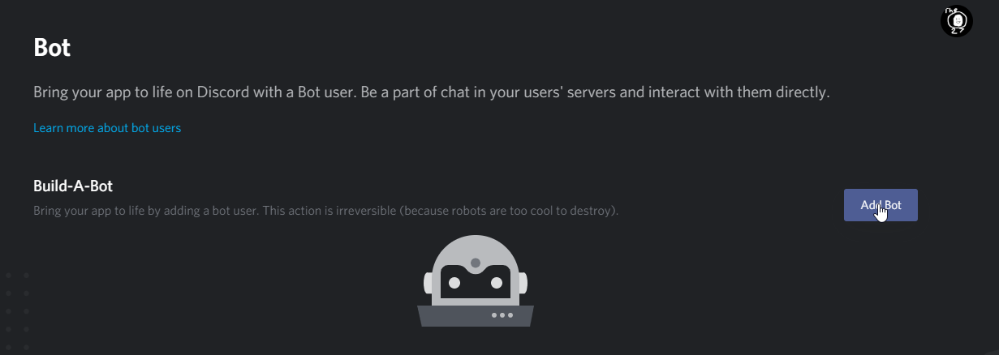
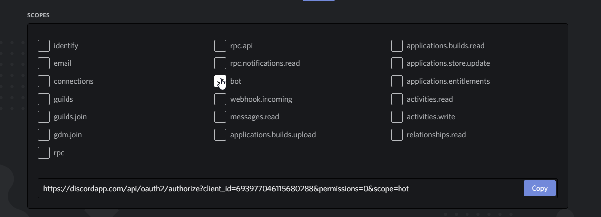

# Eggbot Self-Hosting

### Creating a bot
1. To host Eggbot (or any bot), you'll need a bot account from https://discordapp.com/developers/applications/

2. Click New Application\

3. Name the application (We recommend setting Team to Personal)\

4. Click Bot \

5. Add a bot (just click yes for the popup I guess) \

### Linking the bot to Eggbot code

1. Run eggbot.py from a [fresh copy](https://github.com/TheEgghead27/Eggbot/archive/master.zip), then press enter to start the setup. Anyone using an older configuration will have their files automatically converted.

2. Get the token from your bot \

3. Make a token.txt out of the text you got \

4. Right click your Discord account in chat\
 

5. Copy your ID \

6. Enter it in the terminal\

7. If you want to give others permission, you must enter their IDs, one by one, into the field. Enter nothing to continue.\

8. Configure your settings as the wizard dictates.

9. Press enter to start up the bot.

### Inviting your bot/Finalizing the setup

1. Go to the Oauth section of your [application](https://discordapp.com/developers/applications/) \

2. Click Bot Scope \

3. Click these permissions \

4. Use the generated link to invite your bot to your server (like any other bot)\
 

5. Go to \

\
and have a moderator add your bot with the bot invite link.

6. Run the eggbot.py Python script, with no further need for setup.

Enjoy!
