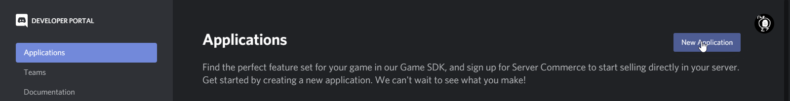
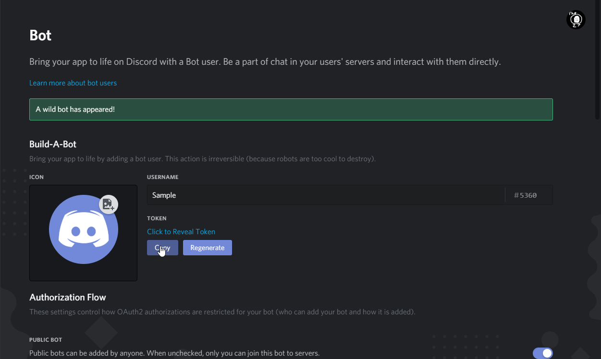

# Eggbot Self-Hosting

1. To host a bot, you'll need a bot account from https://discordapp.com/developers/applications/

2. Click New Application\
  

3. Name the application (We recommend setting Team to Personal)\
 

4. Click Bot \

5. Add a bot (just click yes for the popup I guess) \

6. Get the token from your bot \

7. Make a token.txt out of the text you got \

8. Go to Oauth section \

9. Click Bot Scope \

10. Click these permissions \

11. Use the generated link to invite your bot to your server (like any other bot)\
 

12. Right click your Discord account in chat\
 

13. Copy ID \

14. Paste it in a host.txt (note: you can have multiple admins by typing their ids in a separate line of the file)\

18. Download and unzip the files from the latest Eggbot-self-host.X.X https://github.com/TheEgghead27/Eggbot/releases \

19. Place your token and host.txt's in the folder\

22. Run convert.py\
[IMAGE NOT FOUND]

20. Go to\
 
\
and have a moderator add your bot with the bot invite link.

21. Run the eggbot.py Python script.

Enjoy!
