# Eggbot
Basic text pusher with embed message functionality

## Discord

## Commands
e!help: help

e!about: about the speaking/first mentioned user

e!args {arguments}: list of args

e!bee: prints bee movie script (WIP)

e!kiri: displays an image of Eijiro Kirishima from My Hero Academia [request from Eijiro Kirishima#6669]

e!song: song (WIP)

egg: egg

e!eggcount: counts the day's eggs

simp: SIMP

### Owner-Only Commands

e!say: says whatever you tell it to say

e!shutdown: shuts the bot down without needing to manually stop the script

## Official Tester Host (Only on when testing the bot)
https://discordapp.com/api/oauth2/authorize?client_id=681295724188794890&permissions=3537984&scope=bot

## Self-Host
(GitHub Pages messed up the step numbers)

1. To host a bot, you'll need a bot account from https://discordapp.com/developers/applications/

2. Click New Application 

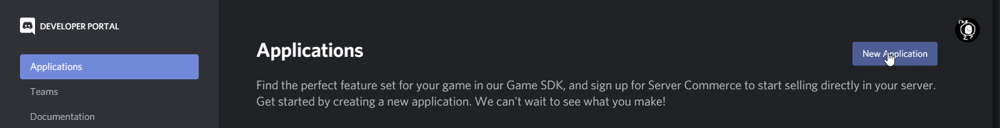

3. Name the application (We recommend setting Team to Personal)

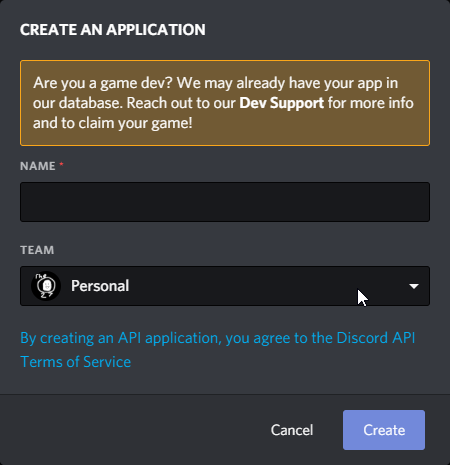

4. Click Bot

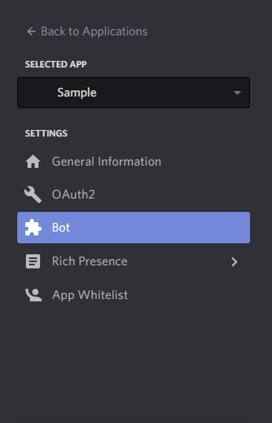

5. Add a bot (just click yes for the popup I guess)

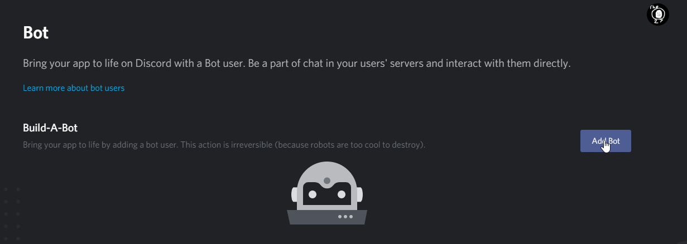

6. Get the token from your bot

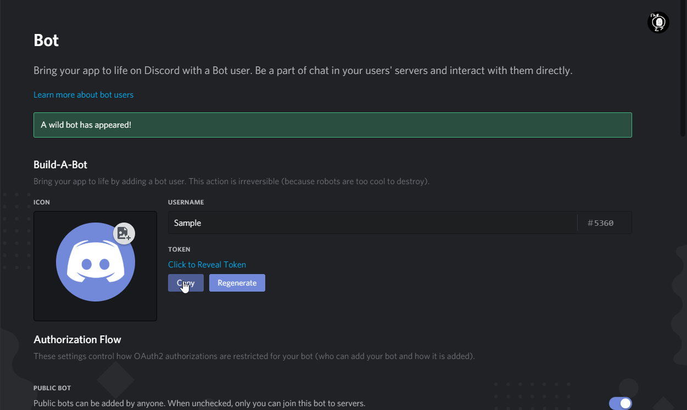

7. Make a token.txt out of the text you got

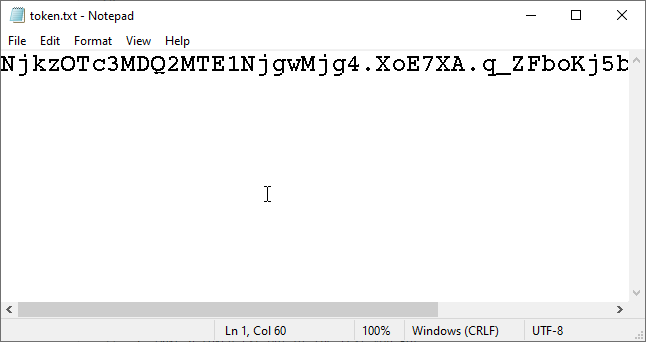

8. Go to Oauth section

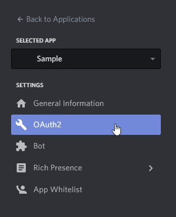

9. Click Bot Scope

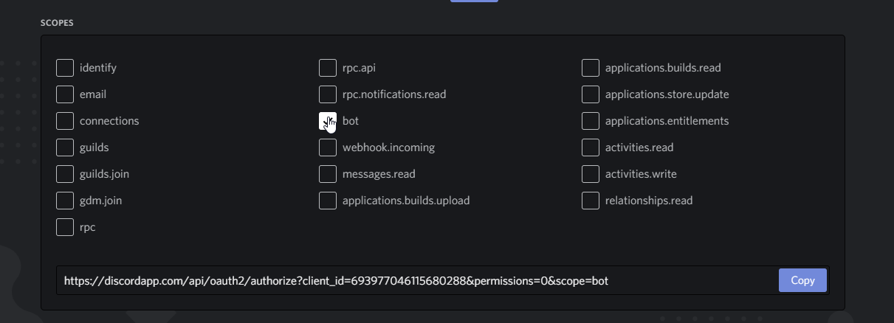

10. Click these permissions (these have changed recently, so if you are getting exceptions, kick the bot and make a new link with these permissions)

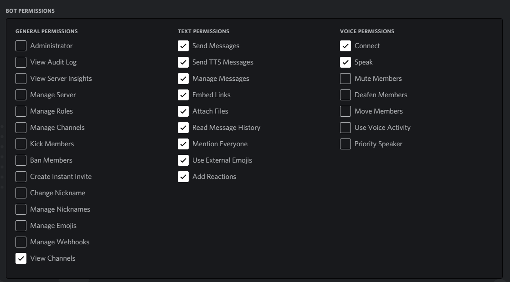

11. Use this link to invite your bot to your server (like any other bot)

12. Download and run eggbot-release.py, with token.txt in the same folder as the main script

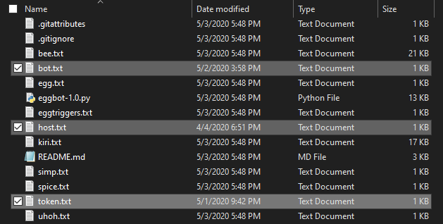

13. Right click your Discord account in chat

14. Copy ID 

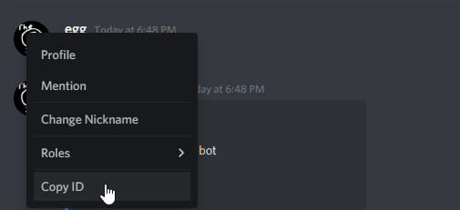

15. Paste it in a host.txt

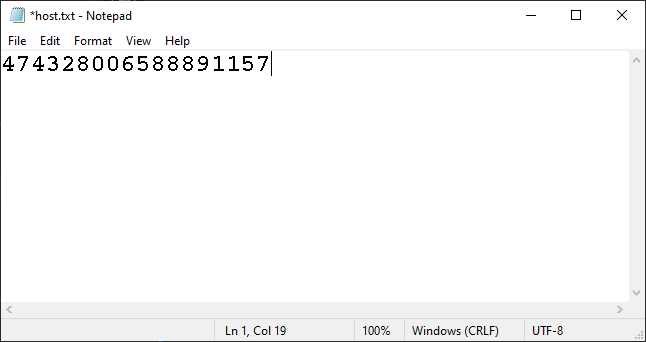

16. Right click your Bot account in chat

17. Copy ID 

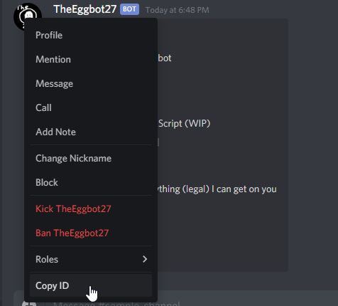

18. Paste it in a bot.txt

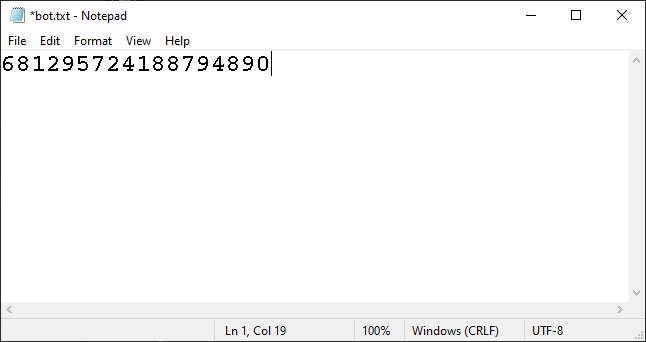

19. Setup the release.py, kiri.txt, bee.txt, and prerequisite txt files like so.

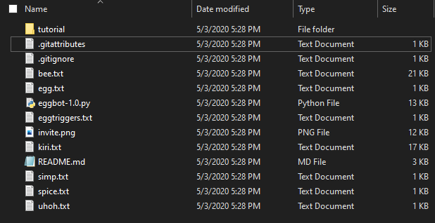

20. Go to 

and have a moderator add your bot with the bot invite link.

21. Run the Python script.

Enjoy!
