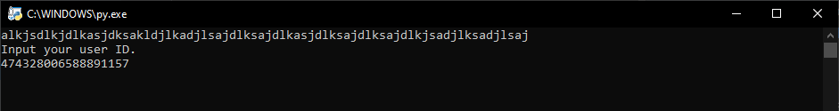
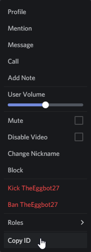

# Eggbot
Basic text pusher with embed message functionality

## Discord

## Commands
e!help: help

e!about: about the speaking/first mentioned user

e!args {arguments}: list of args

e!bee: prints bee movie script (WIP)

e!kiri: displays an image of Eijiro Kirishima from My Hero Academia [request from Hanako-kun#6669]

e!song: song (WIP)

e!github: Links to this Github Repo

e!invite: DMs you an invite to the official Discord Server

egg: egg

e!eggcount: counts the day's eggs

simp: SIMP

### Owner-Only Commands

e!say: says whatever you tell it to say

e!shutdown: shuts the bot down without needing to manually stop the script

## Self-Host
(GitHub Pages messed up the step numbers)

1. To host a bot, you'll need a bot account from https://discordapp.com/developers/applications/

2. Click New Application  

3. Name the application (We recommend setting Team to Personal) 

4. Click Bot 

5. Add a bot (just click yes for the popup I guess) 

6. Get the token from your bot 

7. Make a token.txt out of the text you got 

8. Go to Oauth section 

9. Click Bot Scope 

10. Click these permissions (these have changed recently, so if you are getting exceptions, kick the bot and make a new link with these permissions) 

11. Use this link to invite your bot to your server (like any other bot) 

12. Right click your Discord account in chat 

13. Copy ID 

14. Paste it in a host.txt

15. Right click your Bot account in the member list

16. Copy ID\
 

17. Paste it in a bot.txt

18. Download and unzip the files from https://github.com/TheEgghead27/Eggbot/archive/self-host.zip \

19. Place your token, bot, and host.txt's in the folder

19. Go to\
 
\
and have a moderator add your bot with the bot invite link.

20. Run the Python script.

Enjoy!
