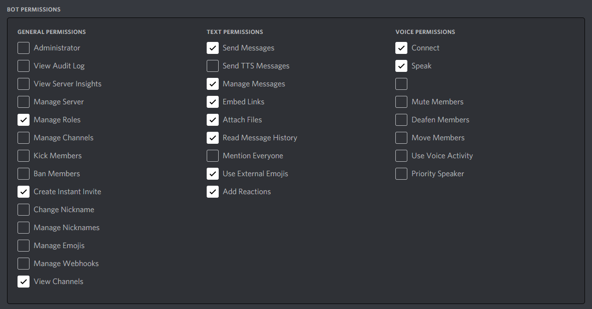

# Eggbot
Basic text pusher with embed message functionality

## Commands

e!bee : prints bee movie script (WIP)

egg : egg

e!args {arguments} : list of args

e!song : song (WIP)

e!help : help

## Official Tester Host (Only on when testing the bot)
https://discordapp.com/oauth2/authorize?client_id=681295724188794890&permissions=384064&scope=bot

## Self-Host
(GitHub Pages messed up the step numbers)

1. To host a bot, you'll need a bot account from https://discordapp.com/developers/applications/

2. Click New Application 

3. Name the application (We recommend setting Team to Personal)

4. Click Bot

5. Add a bot (just click yes for the popup I guess)

6. Get the token from your bot

7. Make a token.txt out of the text you got

8. Go to Oauth section

9. Click Bot Scope

10. Click these permissions

11. Use this link to invite your bot to your server (like any other bot)

12. Download and run eggbot-release.py, with token.txt in the same folder as the main script

Enjoy!
